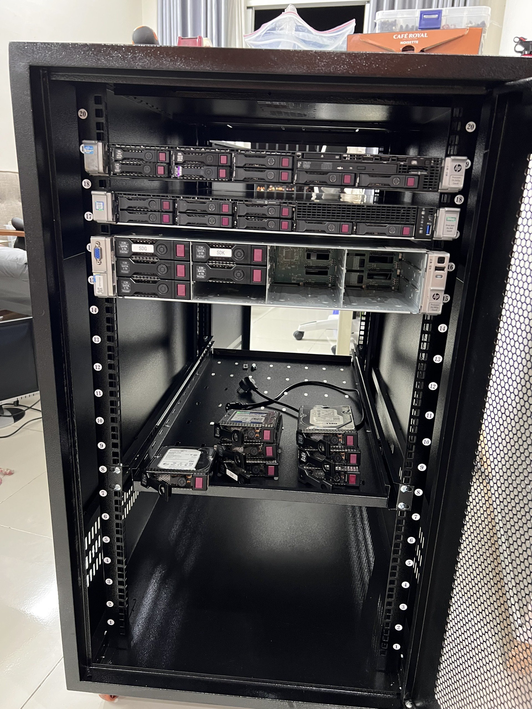

# home-dc-project
My Home DC project 

## Short term

- Buy servers:
  - [x] HP DL360p G8
  - [x] HP DL380p G8
    - [x] Full 12 hard disk drives  
  - [x] HP DL360p G9
- Buy a rack
  - [x] Rack 20U D1000
  - [x] 1x Fixed shelf tray
  - [x] 1x Sliding shelf tray
- Power
  - [x] Basic strip power outlet with 16A CB
- Fan
  - Need two quite fans (Noctua ?) + powering solution
- Switch
  - [x] TP-Link TL-SG108 (8-ports Gigabit switch)
- VPN Infrastructure
  - [x] Tailscale
  - [ ] Backup VPN route
- Setting up UPS
  - Gracefully shutdown servers when power is down
  - Be able to start servers again manually after power down

## Mid term
- Temperature and humidity monitoring
- Noise monitoring
- Tailscale VPN using a single board computer (Orange Pi ?)

## Long term
- Fire control and Power safety ?

## Pictures

